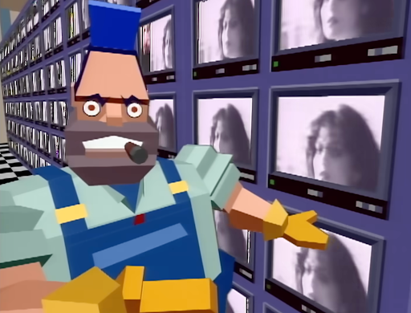
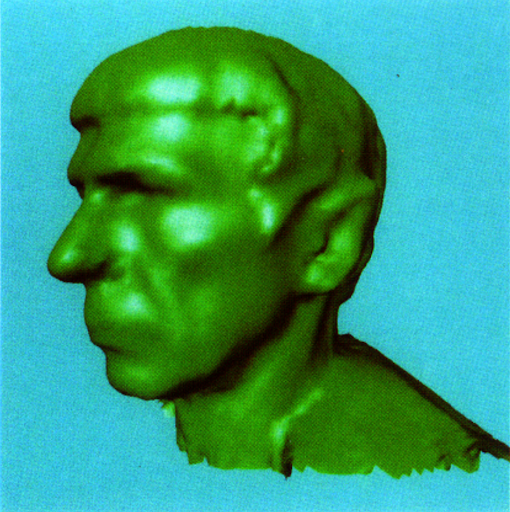
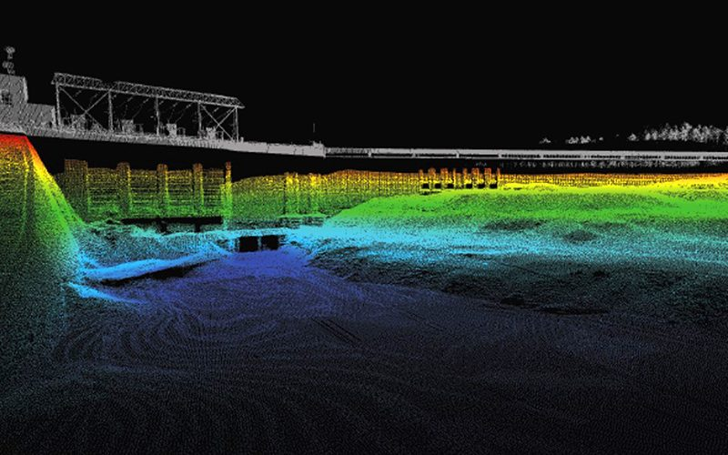
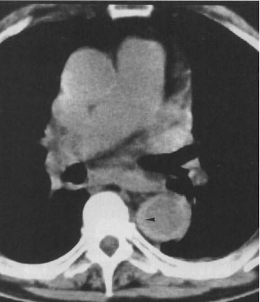

role-playing seminar exercise
premise: writing about paper on some kind of local / campus journal from the point of view of someone reading it in the year it was published (92')

# Latest innovation in computer graphics from local university, and why we should care

Readers might still remember Terminator 2: Judgement day, and its T-1000 terminator. Industry Light and Magic, the special effect studio founded by George Lucas, brought the liquid metal robot to life with the latest advancements in computer graphics technologies. This month on the Technology panel, we will also take a look at one innovation in computer graphics, from the paper Surface Reconstruction from Unorganized Points (H Hoppe et al.) from computer science, statistics, and mathematics departments in University of Washington. We will take a close-up, technical, look at this paper, that we hope will be intriguing to readers with an interest and curiosity in the mathematical and the technical. We will also discuss why these graphics technology could make a difference for research and industries beyond the silver screen, which we hope will be relevant and be thought-provoking for all. 

## Computer graphics, and the SIGGRAPH conference:

Computer graphics is as much a new and novel field as it is a rapidly growing one. Three decades ago, computers were restricted to the server rooms of the largest institutions, and all that could be displayed were arrangements of dots, lines, and simple shapes. In the 70s, computer graphics quickly came into public view with arcade games from Pong to Astroids, and primitive computer effects in movies such as Star Wars. In the last 10 years, Apple brought graphics user interface to personal computing with the Macintosh, while MTV gave us the boxy characters – some of the first computer animated human characters ever – in the MV of the hit song “Money for Nothing”. 

 
<small>Image: Money for Nothing, music video, MTV</small>

Behind the scene, scientists and researchers from around the world had been hard at work to bring about these user space advancements. SIGGRAPH, an annual conference in computer graphics, was first organized by the Association for Computing Machinery (ACM) in 1974, and represents the cutting edge academic and industrial research in this area. Some notable publications of this conference include the Blinn Phong shading model (1977), which shaped the standard of how computers render light and shadow; and marching Cubes (1987), a technology originally developed to visualize medical scan data, that became widely used for geometric processing. The paper we are looking at today, also published at the SIGGRAPH conference, might have the same promise to be another vital innovation in graphics technology. 

## A technical discussion on the paper: 

The paper tries to solve the following problems: Given a collection of unorganized data points on or near an underlying, known surface, how do we recreate this surface, so that it can be rendered in a computer? By unorganized data points, we refer to a series of points in 3 dimensional space, like those obtained from a 3D scan of an object; and  for a surface to be rendered by a computer, it needs to be a structured collection of polygons (often triangles and quadrilaterals), often called meshes. Many have attempted this problem before with varied degree of success; but, as noted by the paper, prior approaches either required extra information such as surface normal (telling us the orientation of the surface at a point), or can only be used on simple geometric shapes (such as spheres or cubes). The paper proposed a new approach not restricted by these limitations, one that uses only the points and works on complex topologies.

The method is divided into three broad steps: Tangent plane estimation, tangent plane orientation, and signed distance function (SDF) estimation. The first step takes each point, and using the statistical method called principal component analysis on the cluster of neighboring points, creates a plane that is roughly tangent to the underlying, unknown surface (referred to as the surface from now on) at this point. 

The second step takes these tangent planes, and tries to orient them in a consistent way. For example, if the underlying surface is a real-world 3D object with a fully enclosed surface, then all tangent surfaces should face “the outside”. The paper does so with a series of intricate algorithms: Starting from the intuition that tangent surfaces at points close to each other will be roughly facing the same direction, the paper fixes orientation of one tangent plane and recursively aligns the rest of tangent planes to already oriented ones. Specifically, the paper builds a special graph (Riemmrnian Graph) where nodes represent each tangent plane, and edge weights represent how closely the neighboring planes are already aligned barring the inside-outside distinction. Then, by traversing the graph in a minimum spanning tree from the starting tangent plane, the algorithm always prioritizes fixing the orientations of neighboring planes already closely aligned to one another, thus creating the optimal set of orientations for all planes.

In the last step, the algorithm turns our series of correctly oriented tangent planes to a signed distance function (SDF). The SDF is a way of representing a surface that, for a grid of points in 3D space, assigns  a value to each point telling us how close or far each point is to the surface, and whether we are on the inside or outside. To do this, the paper takes each point (point for SDF, not the original data point), and finds their perpendicular distance to the nearest tangent planes, and uses that as the estimated SDF distance. SDFs are a common way to represent an unknown underlying surface in graphics research, and many algorithms already exist to turn SDFs into meshes that computers can render and display. The paper uses a variant of the aforementioned Marching Cubes algorithm.

 
<small>Image: the paper’s reconstruction of Spock’s head from 3D scanned data</small>

## Potential applications and (local) relevance:

The method presented by the paper, and others like it, while cutting edge, can sound far away and irrelevant technological innovations. That’s why it’s important for us to take a step back and remind ourselves why these researches matter – after all, part of our tax dollars, state and federal, funds these researches. So how can computer graphics technology, and this paper specifically, be useful, and why should we care? To reiterate, this paper focuses on the specific problem in computer graphics, that turns unstructured data points on or near a surface, to an estimation of this underlying surface that can be rendered by a computer. There are in fact, many potential applications for such technologies, some very close to us too.

Oceanography and hydrography: The school of oceanography at University of Washington, at the waterfront of portage bay, is among the leading institutes globally in its field. Oceanography is the study of the ocean, and is crucial to climate science, ecosystem studies, and marine resources management, especially for an area rich with coastline and marine resources like the PNW. A branch of oceanography called hydrography, which is concerned with the geology of the ocean bed, can particularly benefit from the technology in this paper. It can enable visualizations of data collected from ocean surveys, thus helping local scientists and engineers understand our expansive coastal waters.  

 
<small>Image: Image: Hydrography, ASI Group</small>

Aerospace and manufacturing: Boeing, and the suppliers and contractors around Boeing, has always been a strong presence for our local industry, and among the largest employers in the Puget Sound area. The aircraft manufacturing pipeline heavily involves designing and building tooling and parts, where technologies like 3D scanning and computer aided design (CAD) are a crucial component. A technology that allows accurate visualization of 3D scanned parts will likely bring improvements to the many engineering tasks such as inspection, reverse engineering, and modeling, in the local aerospace and manufacturing industry. 

Hospitals and biomedical research: Local institutions like University of Washington School of Medicine and research institutions like the Fred Hutchinson Cancer Center make Seattle a strong hub for biomedical research. In the area of medical imaging, accurate visualization of 3D medical data from methods like MRI, CT, and 3D ultrasound, are crucial for discovery and diagnosis; the need for medical imaging has in fact long been a collaboration between medical research and computer graphics, driving innovations such as the Marching Cubes algorithm. Now, a novel method for a format of scan data that until now lacked reliable visualization, is sure to be welcomed by both researchers and clinicians. 

 
<small>Image: diagnostic imaging, British Institute of Radiology</small>

Video games and computing: Lastly, probably the most direct connection. Nintendo, the global leading video game publisher with big titles such as Mario and Zelda, moved its American office to Redmond 10 years ago. And Microsoft, also in Redmond, has seen a period of rapid expansion lately. One can easily speculate that the eastside might one day become a hub of employers in the software, technology, and gaming sector. Here the modeling, rendering, and displaying technologies are of direct importances. There might be a future where objects, or even actors, can be brought to life in digital media through 3D scanning and visualization, using a future rendition of the method this paper proposed.

## Conclusion:

This month we looked at the latest advancement in computer graphics from the University of Washington, and speculated how it might be impactful academically and commercially, especially on our local institutions and industries. Computer graphics is an exciting field, and worth keeping an eye on: with the rapid growth of computing power, and the surely decreasing cost on personal computing hardwares, it’s not hard to imagine soon we might all benefit from these innovations in graphics technology.

